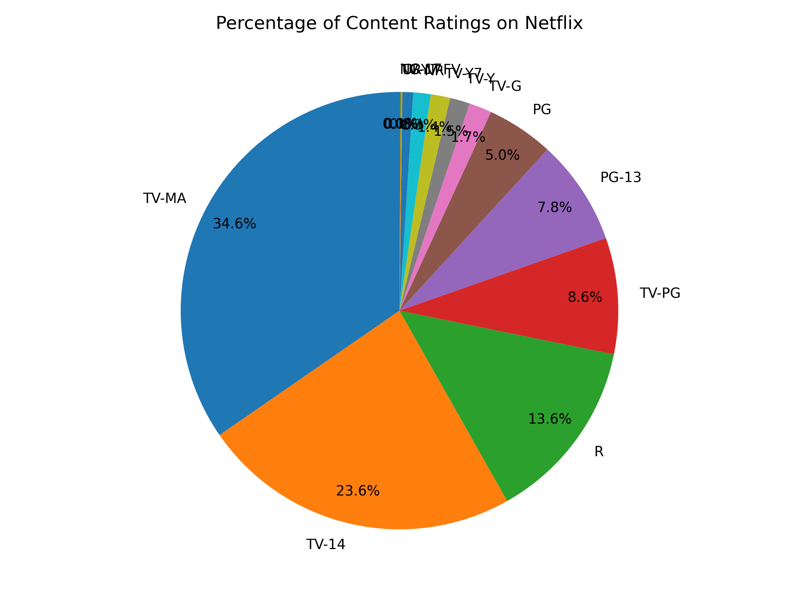
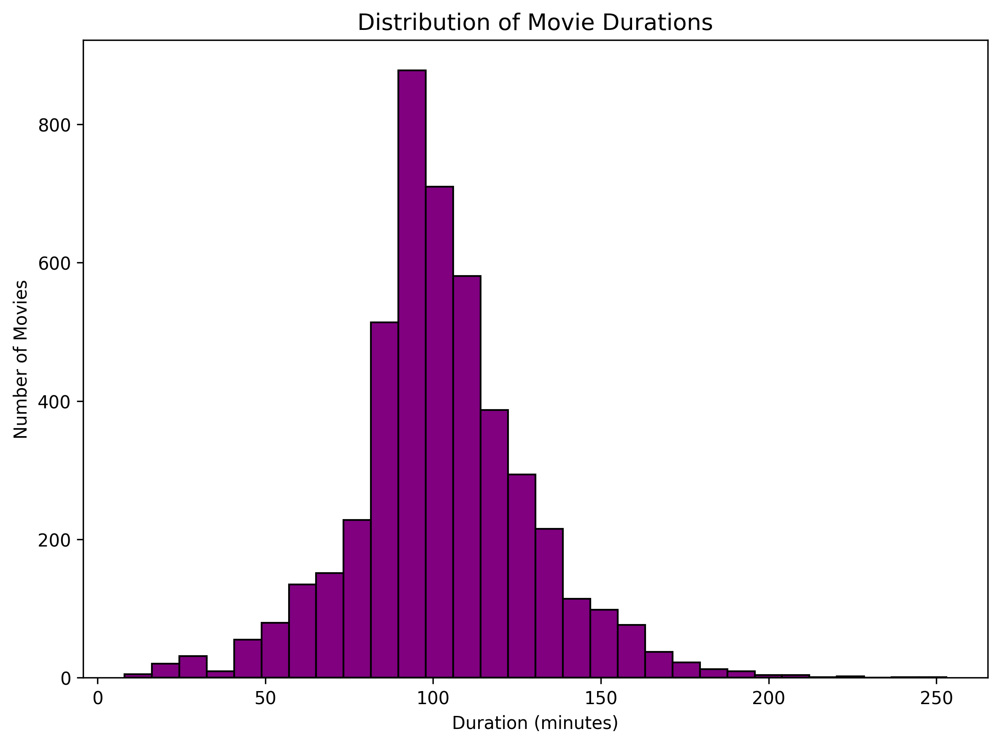
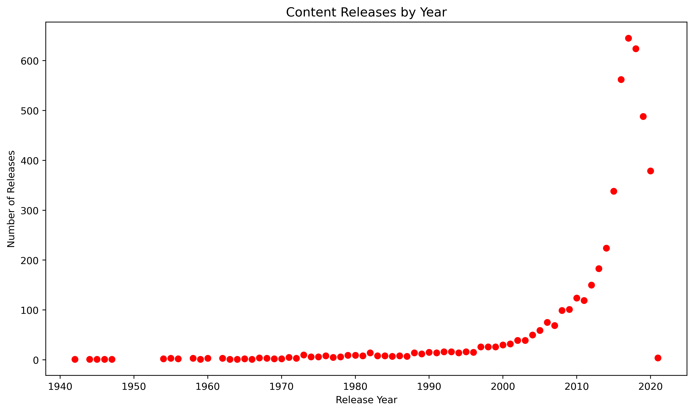
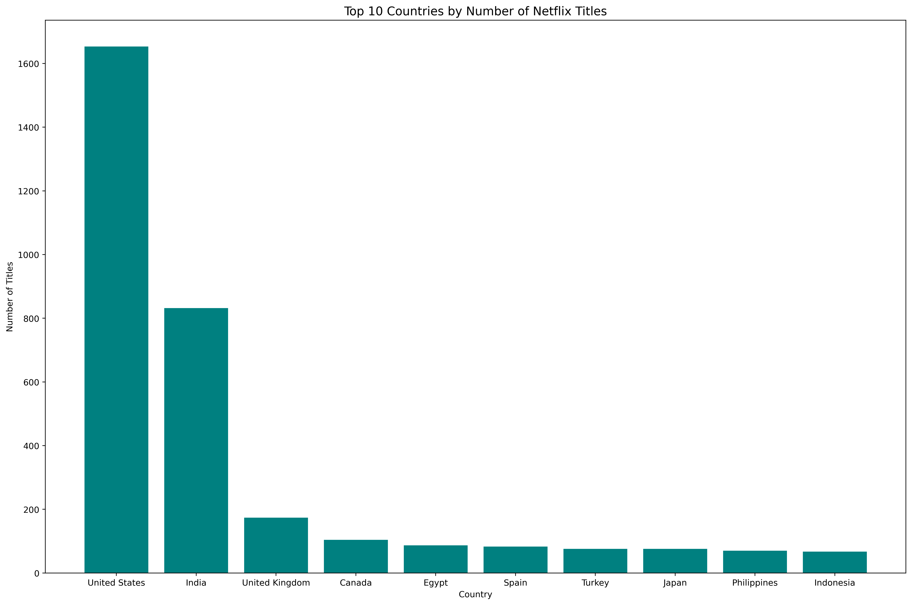
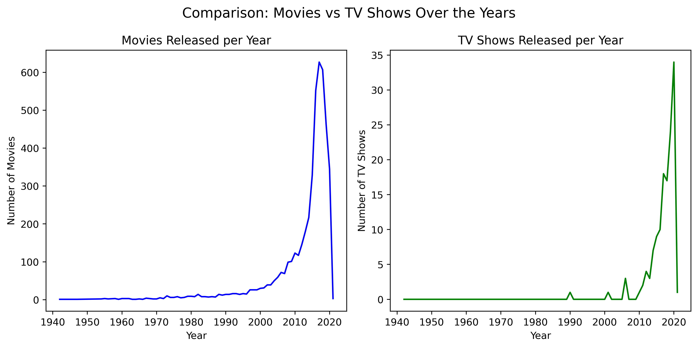

# 🎬 Netflix Content Analysis  

This project performs **Exploratory Data Analysis (EDA)** on Netflix’s dataset using **Python (Pandas + Matplotlib)**.  

---

## 📊 Objectives
- Understand the distribution of Movies vs TV Shows  
- Analyze global content production trends  
- Explore movie durations and ratings  
- Identify top content-producing countries  
- Visualize growth in content over the years  

---

## 🧰 Tools Used
- **Python 3.12.10+**
- **Pandas**
- **Matplotlib**

---

## 📈 Visuals Generated
| Question | Visualization Type |
|-----------|--------------------|
| Movies vs TV Shows | Bar Chart |
| Content Ratings Distribution | Pie Chart |
| Release Trends | Line/Scatter Plot |
| Movie Duration Distribution | Histogram |
| Top 10 Countries | Horizontal Bar Chart |
| Movies vs TV Shows Over Time | Combined Subplots |

---

## 📊 Sample Visualizations

### 🎥 Movies vs TV Shows
Shows the comparison between the number of Movies and TV Shows available on Netflix.  

---

### 🍿 Content Rating Distribution
Illustrates how Netflix content is rated globally (TV-MA, TV-14, PG, etc.).  

---

### ⏱️ Movie Duration Distribution
Displays how movie lengths vary, highlighting the most common duration ranges.  

---

### 📈 Release Year Trends
Visualizes how Netflix’s content library has expanded over time, identifying growth periods.  

---

### 🌍 Top 10 Content-Producing Countries
Shows which countries have contributed the most Movies and TV Shows to Netflix’s platform.  

---

### 🔀 Movies vs TV Shows Comparison Over Time
A multi-plot view showing how Movies and TV Shows evolved together over the years.  

---

## 📂 Files in this Repository
- `netflix_analysis.py` → Main analysis script  
- `NetFlix.csv` → Dataset  
- `output_charts/` → Saved charts and visualizations  
- `README.md` → Project documentation  

---

## 💡 Insights
✅ Netflix’s content library grew rapidly after **2015**.  
✅ **Movies** dominate the platform but **TV Shows** are steadily increasing.  
✅ Ratings such as **TV-MA** and **TV-14** are most common.  
✅ **United States**, **India**, and **UK** are top contributors.  
✅ Average movie durations fall between **80–120 minutes**.  

---

⭐ **Author:** [Abdul Rafay]  
📧 *Email:* contactwithrafay@gmail.com  
💼 *Portfolio:* [GitHub Profile Link]  

---

> 💬 *This project demonstrates skills in data cleaning, visualization, and storytelling — essential for any Data Analyst or Data Science intern.*
